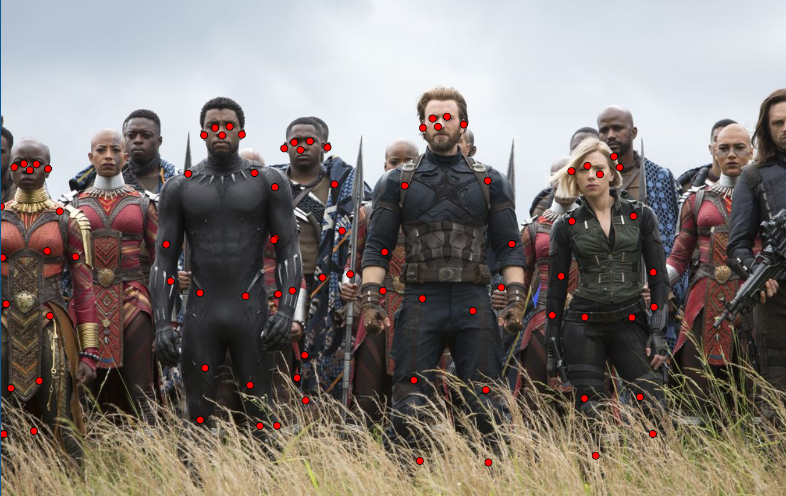

# PoseNet-Vue-P5-example

multi human pose detection example. :) 포즈 인식 모델을 다수의 사람이 있는 이미지에 적용한 결과입니다. 



### technical specs
- Used vue framework to run as web application in local server
- Tried to integrate p5 library to customize visual of keypoints coordinates (work in progress...)

## Project Explanation

### Background
Posenet 은 Tensorflow.js (웹브라우저에서도 딥러닝 모델을 구현하고자 만든 자바스크립트 라이브러리) 오픈 소스 프로젝트 중 하나입니다. PoseNet의 [원본 깃헙](https://github.com/tensorflow/tfjs-models/tree/master/posenet)에서 볼 수 있듯이, 본 모델은 사람 (1명 혹은 다수)의 포즈를 보고 눈, 귀, 코, 그리고 몸의 12개 관절을 포착하거나 예측해서 좌표값을 알려줍니다. 사진뿐만 아니라 웹캠과 같은 실시간 카메라 영상 또한 입력 데이터로 사용할 수 있습니다.

### Idea & Goal
퍼블릭한 공간 혹은 문화향유 공간에 같이 있어도 새로운 사람과의 가벼운 말 한마디나 눈인사가 어색한 이 분위기를 어떻게 풀 수 있을까? 어색할 때 쳐다보는 스마트폰과 같이 기술이 고도화됨에 따라 정말 사람과 사람간의 대화나 교류가 더 줄어들고 어색해진 걸까? 적어도 같은 공간에 있다면 VIRTUAL 보다는 좀 더 그 현장에서의 PHYSICAL 한 인터렉션을 만들어 줄 수 있을까? 라는 물음에서 출발했습니다.

이 프로젝트는 그 물음에 대해 재미있는 애플리케이션으로 답하고자 합니다. 기술을 사용해서 오히려 사람들을 관심을 지금 이 순간에 집중시키고, 다른 사람과의 교류의 시작점을 만들어 주고, POSENET을 이용해서 여러명이 한꺼번에 즐길 수 있는 방향으로 나아갑니다. 이렇게 같은 공간에 같은 것을 즐기러 온 새로운 사람들과의 교류와 만남이 즐거울 수 있다는 경험을 선사해주기 위해 PLAYFUL 한 POSENET APPLICATION을 만들어 갈 예정입니다. 

### Contributors
[박소선](https://github.com/sosunnyproject/), [손은주](https://github.com/EJSohn/), [이재원](https://github.com/insurgent92), [박정현](https://github.com/parkjh688)

### Stay Tuned..
본 프로젝트는 [sosunnyproject](http://sosunnyproject.wordpress.com)의 모두의 연구소 Deep Learning College 및 딥러닝 아트랩에서의 Deep Learning x Art 개인 프로젝트로 계속 발전될 예정입니다.

## Project setup
```
npm install
```

### Compiles and hot-reloads for development
```
npm run serve
```

### Compiles and minifies for production
```
npm run build
```

### Run your tests
```
npm run test
```

### Lints and fixes files
```
npm run lint
```
